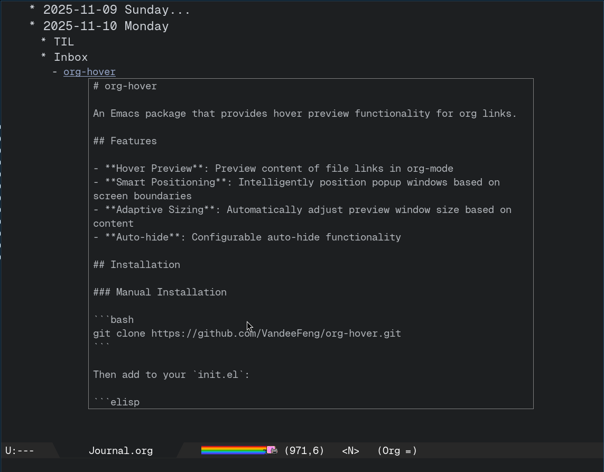

# org-hover

An Emacs package that provides hover preview functionality for org links.



## Features

- **Hover Preview**: Preview content of file links in org-mode
- **Smart Positioning**: Intelligently position popup windows based on screen boundaries
- **Adaptive Sizing**: Automatically adjust preview window size based on content
- **Auto-hide**: Close popup by clicking outside or configure auto-hide after delay

## Installation

### Manual Installation

```bash
git clone https://github.com/VandeeFeng/org-hover.git
```

Then add to your `init.el`:

```elisp
(add-to-list 'load-path "/path/to/org-hover")
(require 'org-hover)
```

## Usage

Basic Usage:

1. In an org file, place cursor on an org file link
2. Press `C-c h` to preview the link
3. Press `C-c H f` to preview any specified file.

## Configuration Options

- `org-hover-auto-hide`

Whether to automatically hide the popup window. Disabled by default.

```elisp
(setq org-hover-auto-hide t)  ; Default: nil (disabled)
```

- `org-hover-auto-hide-delay`

Delay in seconds before auto-hiding the popup window. Only effective when `org-hover-auto-hide` is enabled.

```elisp
(setq org-hover-auto-hide-delay 5)  ; Default: 5 seconds
```


